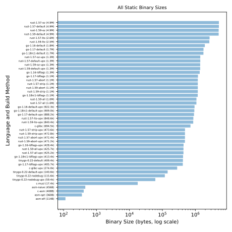

# Tiny Binaries

Tiny static x86-64 Linux binaries which do the following:

1. print `"hi!\n"` to standard output.
2. exit with an exit code of `0`.

The binaries were generated using a variety of languages and build
methods, then sorted by size.

The results from this test were used in the following posts:

* [Tiny Binaries][tb-orig]
* [Tiny Binaries: Assembly Optimization][tb-asm]
* [Tiny Binaries Redux][tb-redux]

## Results

Plot of all results (**Note:** [log scale][] X axis):



Plot of tiny results (less than 1k, linear scale):


Raw size results are available in the [`out/` directory](./out/) in
[CSV][] format.

## Languages and Build Methods

Generated using the following languages and build methods:

| Name | Language | Description |
| ---- | -------- | ----------- |
| `go-1.16-default` | [Go][] 1.16 | Default build options. |
| `go-1.16-ldflags` | [Go][] 1.16 | Built with `-ldflags="-s -w"`. |
| `go-1.16-default-upx` | [Go][] 1.16 | Built with defaults and packed with [upx][]. |
| `go-1.16-ldflags-upx` | [Go][] 1.16 | Built with `-ldflags="-s -w"` and packed with [upx][]. |
| `go-1.17-default` | [Go][] 1.17 | Default build options. |
| `go-1.17-ldflags` | [Go][] 1.17 | Built with `-ldflags="-s -w"`. |
| `go-1.17-default-upx` | [Go][] 1.17 | Built with defaults and packed with [upx][]. |
| `go-1.17-ldflags-upx` | [Go][] 1.17 | Built with `-ldflags="-s -w"` and packed with [upx][]. |
| `go-1.18rc1-default` | [Go][] 1.18rc1 | Default build options. |
| `go-1.18rc1-ldflags` | [Go][] 1.18rc1 | Built with `-ldflags="-s -w"`. |
| `go-1.18rc1-default-upx` | [Go][] 1.18rc1 | Built with defaults and packed with [upx][]. |
| `go-1.18rc1-ldflags-upx` | [Go][] 1.18rc1 | Built with `-ldflags="-s -w"` and packed with [upx][]. |
| `tinygo-0.22-default` | [TinyGo][] 0.22.0 | Default build options. |
| `tinyGo-0.22-nodebug` | [TinyGo][] 0.22.0 | Built with `-no-debug`. |
| `tinygo-0.22-default-upx` | [TinyGo][] 0.22.0 | Built with defaults and packed with [upx][]. |
| `tinygo-0.22-ldflags-upx` | [TinyGo][] 0.22.0 | Built with `-no-debug` and packed with [upx][]. |
| `rust-1.57-default` | [Rust][] 1.57 | Built with `--release` and `build.rustflags = "-C target-feature=+crt-static"`. |
| `rust-1.57-default-upx` | [Rust][] 1.57 | Built with `--release`, `build.rustflags = "-C target-feature=+crt-static"`, and packed with [upx][]. |
| `rust-1.57-abort` | [Rust][] 1.57 | Built with `--release` and `profile.release.panic = "abort"`. |
| `rust-1.57-abort-upx` | [Rust][] 1.57 | Built with `--release`, `profile.release.panic = "abort"`, and packed with [upx][]. |
| `rust-1.57-strip` | [Rust][] 1.57 | Built with `--release` and `build.rustflags = "-C target-feature=+crt-static"`, then stripped with `strip`. |
| `rust-1.57-strip-upx` | [Rust][] 1.57 | Built with `--release` and `build.rustflags = "-C target-feature=+crt-static"`, then stripped with `strip` and packed with [upx][]. |
| `rust-1.57-lto` | [Rust][] 1.57 | Built with `--release`, `build.rustflags = "-C target-feature=+crt-static"`, and `profile.release.lto = true`. |
| `rust-1.57-lto-upx` | [Rust][] 1.57 | Built with `--release`, `build.rustflags = "-C target-feature=+crt-static"`, and `profile.release.lto = true`, then packed with [upx][]. |
| `rust-1.57-oz` | [Rust][] 1.57 | Built with `--release`, `build.rustflags = "-C target-feature=+crt-static"`, and `profile.release.opt-level = "z"`. |
| `rust-1.57-oz-upx` | [Rust][] 1.57 | Built with `--release`, `build.rustflags = "-C target-feature=+crt-static"`, `profile.release.panic = "abort"`, and `profile.release.opt-level = "z"`, then packed with [upx][]. |
| `rust-1.57-all` | [Rust][] 1.57 | Built with `--release`, `build.rustflags = "-C target-feature=+crt-static"`, `profile.release.opt-level = "z"`, `profile.release.panic = "abort"`, and `profile.release.lto = true`, then stripped with `strip`. |
| `rust-1.57-all-upx` | [Rust][] 1.57 | Built with `--release`, `build.rustflags = "-C target-feature=+crt-static"`, `profile.release.opt-level = "z"`, `profile.release.panic = "abort"`, and `profile.release.lto = true`, then stripped with `strip` and packed with [upx][]. |
| `rust-1.59-default` | [Rust][] 1.59 | Built with `--release` and `build.rustflags = "-C target-feature=+crt-static"`. |
| `rust-1.59-default-upx` | [Rust][] 1.59 | Built with `--release`, `build.rustflags = "-C target-feature=+crt-static"`, and packed with [upx][]. |
| `rust-1.59-abort` | [Rust][] 1.59 | Built with `--release` and `profile.release.panic = "abort"`. |
| `rust-1.59-abort-upx` | [Rust][] 1.59 | Built with `--release`, `profile.release.panic = "abort"`, and packed with [upx][]. |
| `rust-1.59-strip` | [Rust][] 1.59 | Built with `--release` and `build.rustflags = "-C target-feature=+crt-static"`, then stripped with `strip`. |
| `rust-1.59-strip-upx` | [Rust][] 1.59 | Built with `--release` and `build.rustflags = "-C target-feature=+crt-static"`, then stripped with `strip` and packed with [upx][]. |
| `rust-1.59-lto` | [Rust][] 1.59 | Built with `--release`, `build.rustflags = "-C target-feature=+crt-static"`, and `profile.release.lto = true`. |
| `rust-1.59-lto-upx` | [Rust][] 1.59 | Built with `--release`, `build.rustflags = "-C target-feature=+crt-static"`, and `profile.release.lto = true`, then packed with [upx][]. |
| `rust-1.59-oz` | [Rust][] 1.59 | Built with `--release`, `build.rustflags = "-C target-feature=+crt-static"`, and `profile.release.opt-level = "z"`. |
| `rust-1.59-oz-upx` | [Rust][] 1.59 | Built with `--release`, `build.rustflags = "-C target-feature=+crt-static"`, `profile.release.panic = "abort"`, and `profile.release.opt-level = "z"`, then packed with [upx][]. |
| `rust-1.59-all` | [Rust][] 1.59 | Built with `--release`, `build.rustflags = "-C target-feature=+crt-static"`, `profile.release.opt-level = "z"`, `profile.release.panic = "abort"`, and `profile.release.lto = true`, then stripped with `strip`. |
| `rust-1.59-all-upx` | [Rust][] 1.59 | Built with `--release`, `build.rustflags = "-C target-feature=+crt-static"`, `profile.release.opt-level = "z"`, `profile.release.panic = "abort"`, and `profile.release.lto = true`, then stripped with `strip` and packed with [upx][]. |
| `c-glibc` | C | Statically linked against [glibc][]. |
| `c-glibc-upx` | C | Statically linked against [glibc][] and packed with [upx][]. |
| `c-musl` | C | Statically linked against [musl][]. |
| `c-asm` | C (w/inline asm) | This is just the `asm-opt` assembly, ported to horrid [gas][] syntax, and embedded in a largely pointless C wrapper. |
| `asm-naive` | Assembly | Unoptimized x86-64 assembly, built with [nasm][] and linked with `ld`. |
| `asm-opt` | Assembly | Optimized x86-64 assembly, built with [nasm][]. |
| `asm-elf` | Assembly | Optimized x86-64 assembly, built with [nasm][].  Code is embedded in unverified portions of the [ELF][] and program header. |

**Notes:**

* [Debian][] only packages [Go][] 1.15.15 as of December 2021.  Yeesh.
* Versions of `gcc`, `upx`, `ld`, `strip`, and `nasm` are from the
  current version of [Debian][].
* C compiled with [GCC][] 10.  I also tested with [Clang][], but the
  results did not appear to be substantially different.
* `c-glibc-upx` binary packed with `upx --brute` produced no output, so it uses
  `upx --best` instead.
* `upx` fails with `NotCompressible` when run against `c-musl`.
* `upx` refuses to compress any of the `asm` binaries.
* [Rust][] optimization options were borrowed from [Minimizing Rust
  Binary Size][rust-min].
* [Rust][] binaries packed with `upx --brute` produced no output, so they use
  `upx --best` instead.
* [Rust][] nightly has `cargo-features = ["strip"]` but it is not available in
  stable, so I used `strip -s` instead.
* As of 2021-12-30, [Rust][] nightly fails to build static binaries with
  warnings about `getpwuid_r` and `getaddrinfo` in statically linked
  binaries.  See `Dockerfile` for full error.
* The `opt-nostd` build fails in [Rust][] 1.57 and [Rust][] nightly as of
  2021-12-31.  See `Dockerfile` for full error.
* ELF/PH overlap and unverified byte regions used by `asm-elf` were borrowed from
  [Tiny ELF Files: Revisited in 2021][tiny-elf].  Thanks Nathan!

## Build Instructions

There is a top-level `Dockerfile` which you can use to generate all
of the binaries, the output [CSV][], and the output [SVGs][svg].

```sh
# build all stages
docker build -t pablotron/tiny-binaries .
```

You can save the generated [CSV][] and [SVGs][svg] to an output
directory like so:

```sh
# create output directory and set permissions
mkdir ./out && chmod 777 ./out

# bind mount output directory, then copy generated reports to output directory
docker run --rm -it -v $(pwd)/out:/out pablotron/tiny-binaries
```

You can inspect the generated binaries in `/data/bin` like this:

```sh
# execute shell in container
docker run --rm -it pablotron/tiny-binaries sh

# switch to output binary directory
cd /data/bin

# install file
apk add file

# verify that binaries are statically linked
file *

# verify binary file sizes
wc -c *
```

[nasm]: https://www.nasm.us/
  "Netwide Assembler"
[svg]: https://en.wikipedia.org/wiki/Scalable_Vector_Graphics
  "Scalable Vector Graphics"
[csv]: https://en.wikipedia.org/wiki/Comma-separated_values
  "Comma-Separated Values"
[gas]: https://en.wikipedia.org/wiki/GNU_Assembler
  "GNU assembler (horrible AT&T syntax)"
[elf]: https://en.wikipedia.org/wiki/Executable_and_Linkable_Format
  "Executable and Linkable Format"
[upx]: https://en.wikipedia.org/wiki/UPX
  "Ultimate Packer for eXecutables"
[glibc]: https://en.wikipedia.org/wiki/Glibc
  "GNU C library"
[musl]: https://en.wikipedia.org/wiki/Musl
  "musl C standard library"
[go]: https://golang.org/
  "Go programming language"
[rust]: https://www.rust-lang.org/
  "Rust programming language"
[debian]: https://debian.org/
  "Debian Linux distribution"
[tiny-elf]: https://nathanotterness.com/2021/10/tiny_elf_modernized.html
  "Tiny ELF Files: Revisited in 2021"
[log scale]: https://en.wikipedia.org/wiki/Logarithmic_scale
  "Logarithmic scale"
[gcc]: https://gcc.gnu.org/
  "GNU Compiler Collection"
[clang]: https://clang.llvm.org/
  "LLVM C language frontend compiler"
[rust-min]: https://github.com/johnthagen/min-sized-rust
  "Minimizing Rust Binary Size"
[tinygo]: https://tinygo.org/
  "Tiny Go compiler for microcontroller and WebAssembly targets."
[tb]: https://pablotron.org/2021/12/31/tiny-binaries/
  "Tiny Binaries"
[tb-asm]: https://pablotron.org/2022/01/01/tiny-binaries-assembly-optimization/
  "Tiny Binaries: Assembly Optimization"
[tb-redux]: https://pablotron.org/2022/03/02/tiny-binaries-redux/
  "Tiny Binaries Redux"
